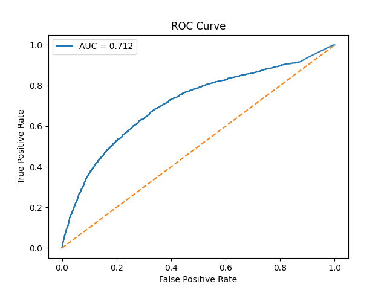
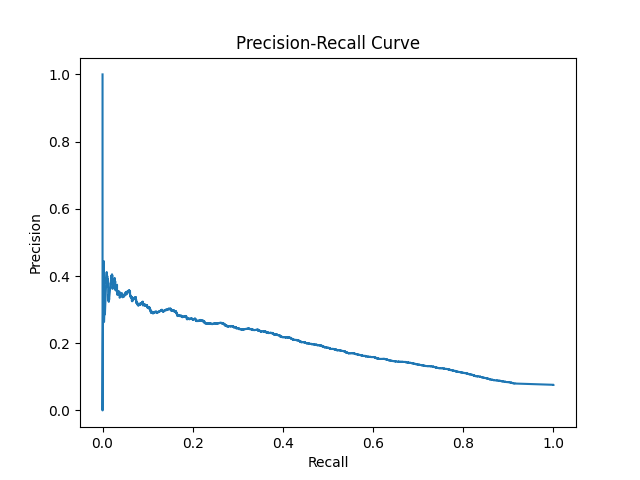
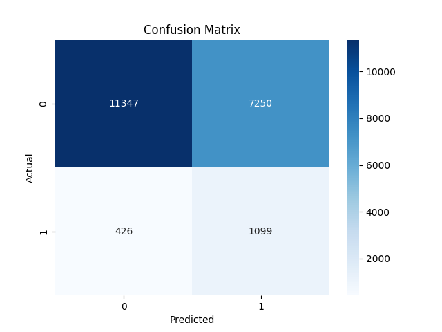
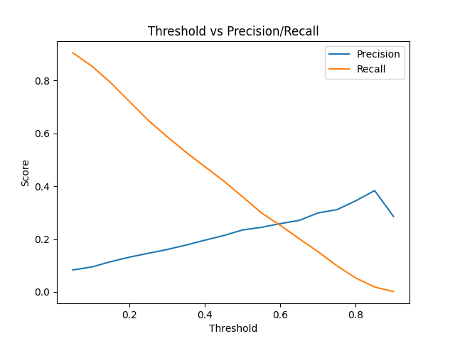

# 📦 Delivery Delay Prediction System — PySpark + Hive + MLlib

A scalable, end-to-end data engineering and machine learning pipeline for predicting e-commerce delivery delays using **Apache PySpark**, **Apache Hive**, and **Spark MLlib**.

---

## 📊 Overview

This project processes the **Olist Brazilian E-Commerce dataset (~100K records across 9 tables)** and predicts whether an order will be delivered late using a **leakage-free machine learning pipeline**.

The system integrates:
- ⚡ Distributed data processing (PySpark)
- 🏗️ Data warehousing (Apache Hive)
- 🤖 Machine learning (Spark MLlib)
- 📈 Visualization (Matplotlib, Seaborn)
- 📊 Interactive dashboard (Streamlit)

---

## 🏗️ Architecture

The pipeline follows a **Bronze–Silver–Gold Medallion Architecture**:

- **Bronze Layer** → Raw CSV ingestion  
- **Silver Layer** → Data cleaning, joins, feature engineering  
- **Gold Layer** → ML predictions + analytical Hive tables  

---

## ⚙️ Pipeline Flow

1. Data ingestion (`ingestion.py`)
2. Multi-table joins (orders, products, customers, sellers, etc.)
3. Data cleaning (`cleaning.py`)
4. Feature engineering (`feature_engineering.py`)
5. Train-test split (**performed before aggregation to prevent leakage**)
6. Aggregated feature computation (seller/category statistics)
7. Model training (`ml_model.py`)
8. Evaluation + threshold tuning
9. Visualization (`visualization.py`)
10. Hive table generation (`build_tables.py`)
11. Streamlit dashboard (`app.py`)

---

## 🧠 Feature Engineering

### Row-Level Features
- `price`, `freight_value`
- `processing_days`, `estimated_days`
- `freight_ratio`, `delivery_pressure`
- `order_month`, `order_dayofweek`

### Aggregated Behavioral Features
- `seller_delay_rate`
- `seller_avg_processing`
- `category_delay_rate`

> ⚠️ Aggregated features are computed **only from training data** to prevent data leakage.

---

## 🤖 Models

Two Spark MLlib models were evaluated:

| Model | AUC | Precision | Recall | F1 Score |
|------|-----|----------|--------|---------|
| **GBT (Selected)** | 0.7126 | 0.132 | 0.716 | **0.223** |
| RF | 0.7178 | 0.118 | 0.770 | 0.204 |

### 🎯 Final Model: Gradient Boosted Trees (GBT)
Selected based on **better F1-score balance**.

### Threshold Used:
`0.2` (chosen to prioritize recall for delayed orders)

---

## 📈 Model Evaluation

### ROC Curve


### Precision-Recall Curve


### Confusion Matrix


### Threshold Analysis


---

## 📦 Outputs

### Hive Tables (Gold Layer)

- `sales_summary`
- `category_revenue`
- `top_products`
- `seller_performance`
- `delivery_performance`
- `monthly_sales`
- `state_sales`
- `delay_predictions`
- `delay_summary`
- `high_risk_sellers`
- `category_delay`

---

## 📊 Dashboard

An interactive **Streamlit dashboard** provides:

- 📈 Revenue trends  
- 📦 Seller performance  
- ⚠️ Delay risk analysis  
- 🔍 High-risk seller detection  

---

## 📥 Dataset

Download manually from:

👉 https://www.kaggle.com/datasets/olistbr/brazilian-ecommerce

Place the dataset files in:
data/raw/

---

## 🛠️ Setup Instructions

### 1. Clone repository

```bash
git clone https://github.com/vinayshankarv/ECommerce-PySpark-Project.git
cd ECommerce-PySpark-Project
